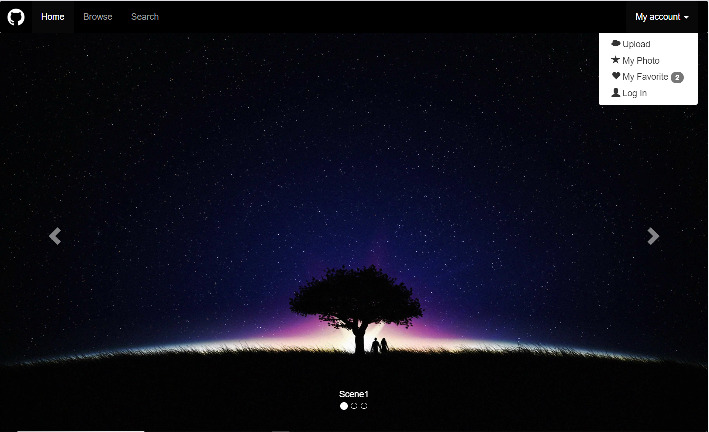
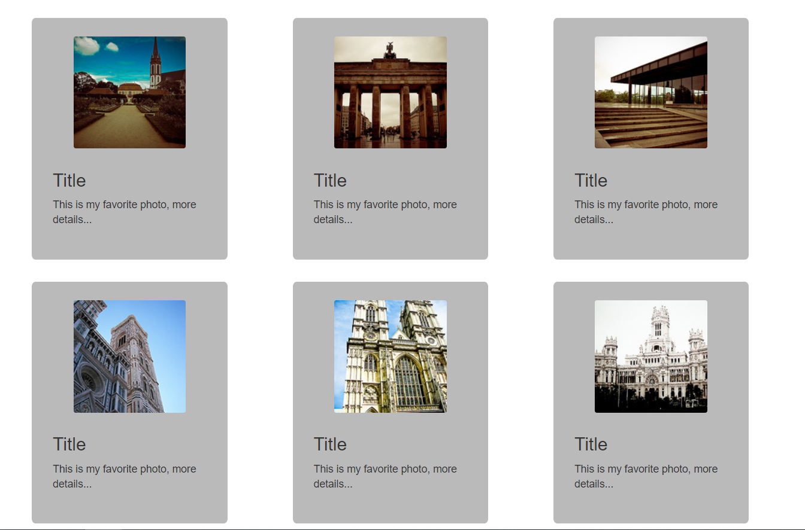
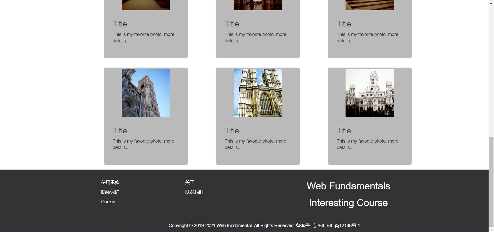

lab4设计文档
====================
## 作业网址
  
https://github.com/sillyboy51666/SOFT130002_lab/tree/master/lab4

---------------------------
## 导航栏

参考ta的样例，使用了bootstrap中的navbar，经过学习发现navbar-header类中的button可以用来完成响应式布局，
当宽度不够时，整个导航栏会用一个下拉菜单来隐藏，对于移动设备友好

My Account采用下拉菜单，给下拉菜单的选项添加了glyphicon图标，特别给My favorite添加了徽章，用来显示新增加的图片数量

添加了Brand图片，设置图片高度适应导航栏

---------------------------------------------
## 轮播

参考ta的样例完成，运用一个carousel-indicators类与carousel-inner类实现轮播图，左右两边的控件则是用carousel-control类完成

用css将导航栏和轮播图的间距抹去了，使得整个页面更加紧凑



---------------------------------------
## 热门图片

采用栅格系统，借助于thumbnail完成对于缩略图的展示，给div和img加上了圆角边框和背景，设定了一定的间距，使整体更加美观



-------------------------------------
## 页脚

用栅格系统作为实现布局，没有什么很好的创意，就添加了web fundamentals interesting course的段落

修改了a中字体的样式，hover状态下也不会有下划线，颜色设置也更加合理






