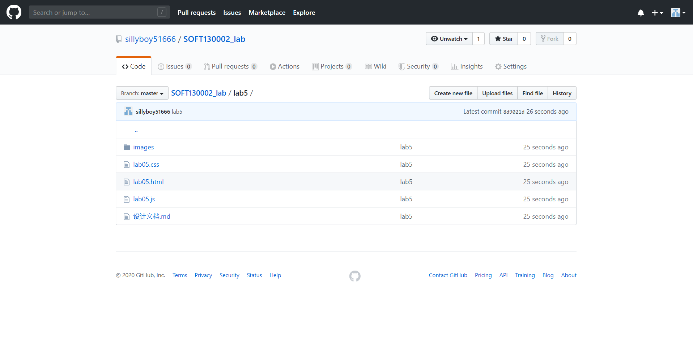
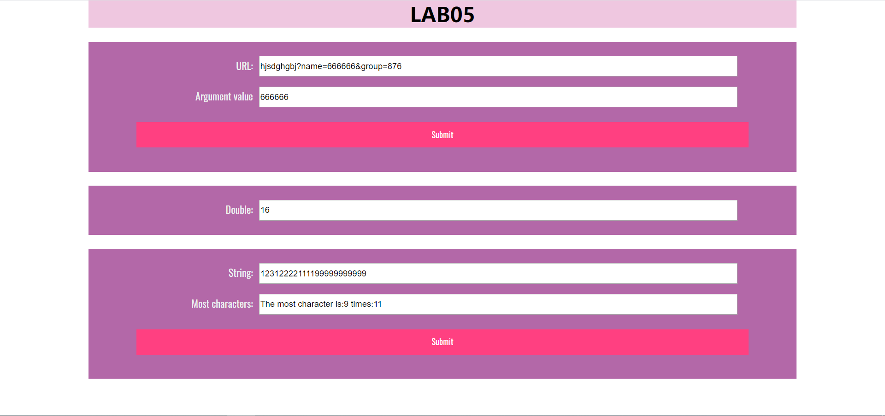

lab5设计文档
====================
## 作业网址  

https://github.com/sillyboy51666/SOFT130002_lab/tree/master/lab5

github网页截图:



---------------------------
## 1. 获取url中名为name的参数

function showWindowHref()的部分代码如下：
````
let urlArguments = url.value.split(/[?&]/);
let name = false;
for (let i = 0; i < urlArguments.length; i++) {
    if (urlArguments[i].substring(0, 5) === "name=") {
        url_result.value = urlArguments[i].slice(5);
        name = true;
    }
}
if (!name) {
    url_result.value = "No name";
}
````

先用split将url的字符串通过"?"和"&"分割开来，在分割后的数组中的每个字符串中查找name=，如果找到，就将这个字符串name=之后的值赋予url_result，如果name=没有出现，那么就会出现No name

---------------------------------------------
## 2. 每隔五秒运行一次函数直到某一整分钟停止

完成代码如下:
````
let mul = document.getElementById("mul");
let count = 0;

function timeTest() {
    if (count < 10) {
        mul.value *= 2;
        count++;
    }
}

mul.value = 1;
let run = setInterval(timeTest, 5000);

function checkTime() {
    if (new Date().getSeconds() === 0) {
        clearInterval(run);
    }
}

setInterval(checkTime, 1000)
````

count是函数timeTest()运行的次数，如果count小于10那么mul的值会翻倍, setInterval(timeTest, 5000);表示每个5000ms毫秒会运行一次timeTest(),
同时每隔1s会运行函数checkTime()，用于判断是否到达整分钟，如果到达clearInterval(run);就会停止run的运行

---------------------------------------
## 3. 判断输入框most里出现最多的字符，并统计出来。

function arrSameStr()部分代码如下：
````
function arrSameStr() {
    let mostValue = most.value;
    let characters = {};
    for (let i = 0; i < mostValue.length; i++) {
        if (characters[mostValue.charAt(i)]) {
            characters[mostValue.charAt(i)]++;
        } else {
            characters[mostValue.charAt(i)] = 1;
        }
    }
    let maxNumber = 0;
    let mostCharacter;
    for (let i in characters) {
        if (characters[i] > maxNumber) {
            mostCharacter = i;
            maxNumber = characters[i];
        }
    }
    result.value = "The most character is:" + mostCharacter + " times:" + maxNumber;
}
````

mostValue是输入框most的值，characters是一个对象，用于统计字符出现次数，如果characters不存在某个字符a的属性，就将这个对象的a属性作为1，下次出现a时将这个属性的值加1，等全部统计完之后通过循环搜素搜索最大值即可

网页的效果图如下：




