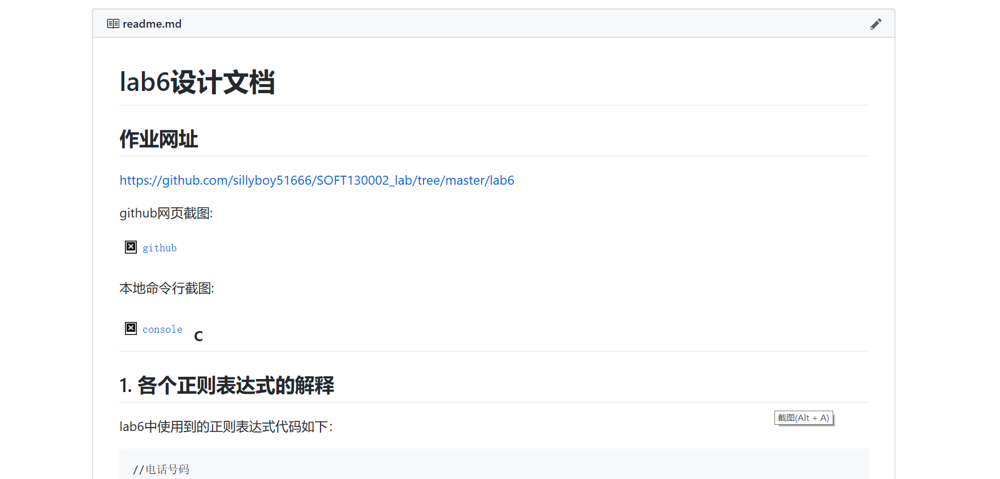
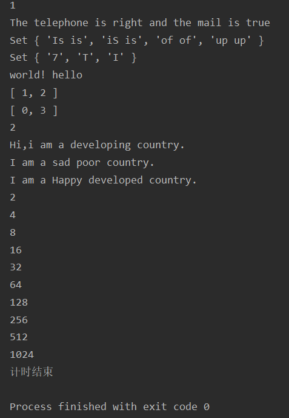

lab6设计文档
====================
## 作业网址  

https://github.com/sillyboy51666/SOFT130002_lab/tree/master/lab6

github网页截图:



本地命令行截图:


c
---------------------------
## 1. 各个正则表达式的解释

lab6中使用到的正则表达式代码如下：
````
//电话号码
/^1[3456789]\d{9}$/

//电子邮箱
/^[a-zA-Z0-9_-]+@[a-zA-Z0-9_-]+(\.[a-zA-Z0-9_-]+)+$/

//寻找相邻重复单词
/\b([a-z]+) \1\b/ig
````

电话号码：^与$表示开头和结尾。一般来说手机号的第一位是1，第二位是3-9的某一个数字，所对应的正则表达式也就是[3456789],
随后的9位数字式任意的，用\d{9}代表任意9个数字。

电子邮箱：^与$表示开头和结尾。@前面部分可以是任意的数字、大小写字母、下划线,杠的组合，可以用[a-zA-Z0-9_-]+来表示，
其中+就是说方括号内的部分出现至少一次。@后面的第一部分是同样的。随后的第二部分类似于.xx.yy的样子，\.是转义字符，[a-zA-Z0-9_-]+作用同上，
把这两部分放在一起重复也就是(\.[a-zA-Z0-9_-]+)+了

寻找相邻重复单词：\b匹配一个单词的边界，[a-z]+可以认为是一个单词，\1代表对第一部分重复，最后的i，g分别表示忽略大小写和全局匹配

---------------------------------------------
## 2. 继承不同方式的理解

###借用构造函数

代码如下：
```
function DevelopingCountry() {
    Country.call(this, "发展中国家");
    if (typeof this.sayHi !== "function") {
        DevelopingCountry.prototype.sayHi = function () {
            console.log("Hi,i am a developing country.");
        };
    }
}
```

基本思想是在子类构造函数内部调用父类构造函数，也就是在子类实例中创建了父类属性
我觉得这个继承方式不是很好的，父类实例方法和原型都无法使用

###原型链

代码如下：
```
function PoorCountry() {
    this.name = "贫困国家";
}

PoorCountry.prototype = new Country();
PoorCountry.prototype.saySad = function () {
    console.log("I am a sad poor country.");
};
```

本质是父类中的实例属性会成为子类的原型属性
我比较喜欢这个方法，虽然还是有一些问题，比如构造子类实例的时候很不方便，但这种方式非常有js的特点，

###Object.create

代码如下：
```
let developedCountry = Object.create(new Country(), {
    name: {
        value: "发达国家"
    },
});
developedCountry.sayHappy = function () {
    console.log("I am a Happy developed country.");
};
```

本质是基于已有对象创建新对象，我觉得这种继承方式比较适合在只需要创建很少的子类实例的情况下使用

---------------------------------------
## 3. Map、Set、Array之间的区别和使用。 
Map：储存的是键值对，但是键可以是任意类型的，对于同一个键多次赋值将覆盖前次赋值，好像在很多时候可以替掉一层循环。
第6题中，我们只需要把之前看过得数字存放在map中，考察下一个字符与target得差值是否在map中就可以了，查找之后再把这个数字放入map中，反复循环就可以得到答案。
第7题中，字符为键，出现位置为值，向后查找过程中，通过比较考察的值在map中对应的值（可能不存在，这时可以直接将这个值存入map中，转入下一个字符）与当前子串的起始位置比较，
就可以知道是否重复了。

Set：成员值都是唯一的。在第4题中，将两个字符串都变成大写后再转换成成set，就可以很方便得得到整个字符串中出现得字符，再将两个set数组进行一些比较就可以得到答案了

Array：可以认为是一般的js数组，好处是对于数组处理的方法很多。在第5题中，先用split分割出单词部分，再用reverse的话就十分方便了。


