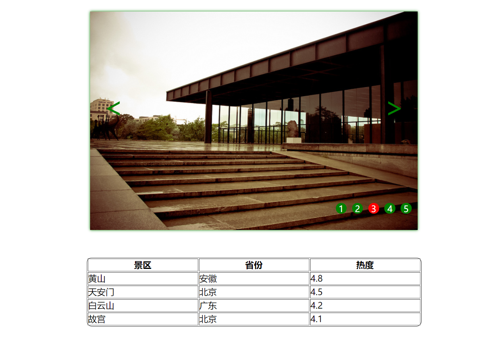
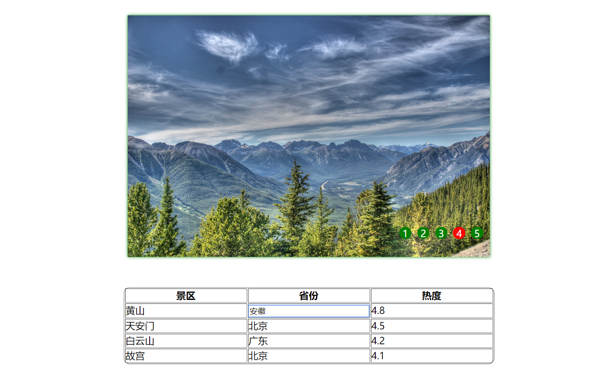
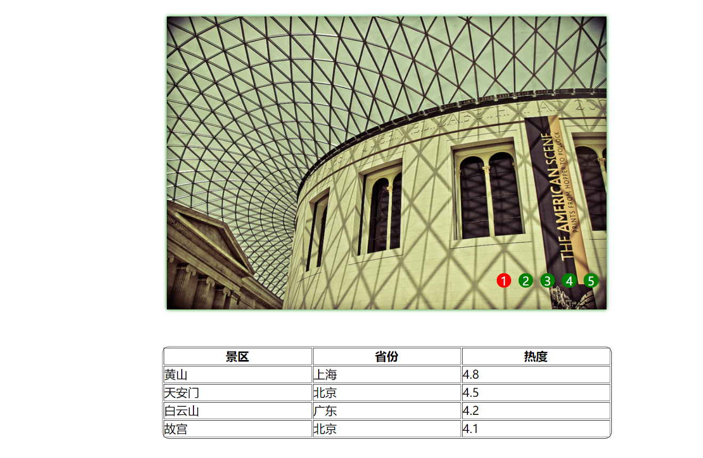

lab8设计文档
====================
## 作业网址  

https://github.com/sillyboy51666/SOFT130002_lab/tree/master/lab8

---------------------------
## 1. 任务1

任务1代码如下：
````
function leftMove() {
    buttons[picIndex - 1].className = "";
    picIndex = (picIndex === 1) ? 5 : picIndex - 1;
    buttons[picIndex - 1].className = "on";
    wrap.style.left = (-picIndex * 600) + "px";
}

function rightMove() {
    buttons[picIndex - 1].className = "";
    picIndex = (picIndex === 5) ? 1 : picIndex + 1;
    buttons[picIndex - 1].className = "on";
    wrap.style.left = (-picIndex * 600) + "px";
}

document.querySelector(".arrow_left").addEventListener("click", leftMove);
document.querySelector(".arrow_right").addEventListener("click", rightMove);
````

任务一主要在于leftMove()和rightMove()方法上，picIndex为轮播图现在图片的编号，左移动只要让picIndex减去1(如果picIndex是1的话就设置成5)，
然后改变buttons中class名为on的元素对应现在的picIndex，最后再设置wrap的left属性使我们想要的图片显示就可以了

---------------------------------------------
## 2. 任务2

任务2的代码如下：
```
function autoplay() {
    let clock = setInterval(rightMove, 2000);
    container.addEventListener("mouseover", function () {
        clearInterval(clock);
    });
    container.addEventListener("mouseout", function () {
        clock = setInterval(rightMove, 2000);
    });
}

autoplay();
```

clock设定rightMove()方法每两秒运行一次，分别设置container的mouseover事件和mouseout事件就可以了

---------------------------------------
## 3. 任务3

任务3的代码如下：
```
for (let i = 0; i < buttons.length; i++) {
    buttons[i].addEventListener("click", function () {
        buttons[picIndex - 1].className = "";
        picIndex = i + 1;
        buttons[picIndex - 1].className = "on";
        wrap.style.left = (-600 * picIndex) + "px";
    })
}
```

利用循环将buttons中的每一个元素都绑定click事件，这一事件的处理思路和rightMove()是类似的，改变现在的picIndex，设置buttons中的对应元素的类名，
最后修改wrap的left显示对应图片即可

---------------------------------------
## 3. 任务4

任务4的代码如下：
```
function editTable() {
    let editable = true;
    let input = document.createElement("input");
    $(input).css({"width": "98%", "height": "95%"});
    $("td").click(function () {
        if (editable) {
            editable = false;
            input.value = this.innerHTML;
            $(this).empty();
            $(this).append(input);
            input.focus();
            input.selectionStart = 0;
            input.selectionEnd = 0;
        }
    });

    input.addEventListener("blur", function () {
        this.parentElement.innerHTML = this.value;
        editable = true;
    })
}

editTable();
```

设置editable防止在编辑过程中再次处理点击事件

编辑表格的主要思路就是创建一个input元素，点击表格中的td时将input显现，若焦点从input上移出，那么input消失，input中的内容设置为相应td的内容

利用selectionStart和selectionEnd可以控制选取的范围，都取0就可以满足光标自动定位于单元格的首个字符或者汉字前的要求

效果图如下：





